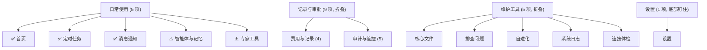

# Agent Butler 产品审计报告

> **审计视角**：产品经理 + Hermes 用户（P1 小白 → P3 高级用户）  
> **审计版本**：`0.1-beta.260918.1`（main）  
> **审计日期**：2026-09-20  

---

## 一、总体评价

Agent Butler 是一个**工程质量出众但产品复杂度超载**的本地 AI 管家。它在安全、可观测性和自愈架构上的投入远超同类工具，但信息架构的膨胀速度已经超过了目标用户（尤其是 P1 小白用户）的消化能力。

```
                    工程质量
                    ████████████  9/10
                    
                    安全设计
                    ████████████  9/10
                    
                    P1 用户体验
                    ██████░░░░░░  5/10
                    
                    P2 用户体验
                    ████████░░░░  7/10
                    
                    P3 用户体验
                    ██████████░░  8.5/10
                    
                    产品聚焦度
                    █████░░░░░░░  4/10
                    
                    可维护性
                    ██████░░░░░░  5.5/10
```

> [!IMPORTANT]
> 这个项目最大的风险不是技术债务，而是**产品膨胀**——23 个路由页面、32 张数据库表、100+ API 端点，对于一个 Beta 阶段的本地工具来说显著偏重。

---

## 二、信息架构审计

### 2.1 用户目标 vs 页面数量的断裂

PRODUCT.md 定义了三类用户和五个日常入口（首页、任务、消息、智能体与记忆、设置），但实际路由表有 **23 个独立页面**。核心矛盾：

| PRODUCT.md 承诺 | 实际状态 |
|---|---|
| "日常入口只有五个" | 侧栏 5 项 + 折叠组 14 项 + 隐藏入口 4 项 = **23 页** |
| P1 "不希望看仪表盘" | 首页本身就是仪表盘（健康状态、巡检、连接、消息…） |
| "先给结论" | 首页确实做到了结论先行 ✅ |
| "一键操作" | 大部分页面做到了 ✅ |

**结论**：侧栏 5 个一级入口的设计是正确的，可折叠分组将信任层 14 项压缩成一行也是聪明的做法。但问题是这些折叠组「打开后」的认知负荷——9 项信任层 + 5 项维护工具对 P1/P2 用户来说仍然是信息过载。

### 2.2 导航分组合理性



**问题发现**：

| # | 问题 | 严重度 | 说明 |
|---|---|---|---|
| IA-1 | **「专家工具」定位模糊** | 高 | 既是一级入口（侧栏常显），又声称是"专家"才用的工具。维护工具组里还有「排查问题」「系统日志」等类似定位的页面，用户分不清该去哪 |
| IA-2 | **信任层分簇标签不直觉** | 中 | "费用与记录"和"审计与管控"对 P1 用户是无感词汇。这些标签更像后端开发者对功能域的分类，而非用户心理模型 |
| IA-3 | **「智能体与记忆」覆盖面过广** | 中 | 这个标题下同时承载技能管理、插件市场、记忆探针三个独立子域——标题无法给用户正确预期 |
| IA-4 | **移动端 4 Tab 与桌面 5 项不对齐** | 低 | 桌面有「智能体与记忆」和「专家工具」两个一级入口在移动端消失（需要从抽屉进入），但这两个并非低频功能 |
| IA-5 | **信任层 9 项中有 6 项日常无内容** | 中 | 对 P1 用户来说，「进度可信度」「记忆变更」「实例联邦」等页面在大多数时间是空的——打开发现没内容的体验消磨信任 |

### 2.3 正面评价

- ✅ **[routeMeta.ts](file:///c:/Users/jiach/Documents/Agent%20Butler/ui/src/lib/routeMeta.ts) 单一事实源**：导航、页头、面包屑、移动 Tab 全部从一个数组派生，图标唯一性有测试守住。这是极佳的工程实践。
- ✅ **旧链接兼容**：6 条 legacy redirect，`?tab=` 查询参数也做了保留——这对已有用户非常友好。
- ✅ **首次访问引导**：`FirstRunRedirect` → `/setup` 三环体检，完成后 dashboard 引导创建首个任务——新用户落地路径清晰。

---

## 三、核心功能审计

### 3.1 首页（Dashboard）

**目标**：回答"现在好不好、要不要我点一下"。

**做得好的**：
- ✅ 顶部结论横幅 `health-conclusion` 直接给大白话判断（`health.headline` + `health.explanation`）
- ✅ Agent 在线脉搏动画（`agent-pulse-badge`）直观展示连接状态
- ✅ 大屏模式入口（`/wall`），适合常驻监控场景
- ✅ 运行详情默认折叠（`RuntimeDetails`），不劝退小白

**需要关注的**：
- ⚠️ 首页数据来自 `/api/dashboard` 一次性聚合 + 多个子接口，首次加载延迟可能较长（尤其 Hermes 不在线时）
- ⚠️ 「未完成引导」状态（`OnboardingContinuation`）在 localStorage 存 dismiss 标记——清 browser 数据后会重新出现，用户可能困惑

### 3.2 定时任务（/tasks）

**这是 PRODUCT.md 定义的核心价值**：" Hermes 是唯一调度与执行引擎"。

**做得好的**：
- ✅ 完整的 CRUD：创建/编辑/暂停/恢复/删除/试运行
- ✅ 任务模板（`TASK_TEMPLATES`）降低新建门槛
- ✅ 30 秒自动轮询（`usePolling`），不需要手动刷新
- ✅ 状态分 Tab（全部/启用/暂停/需注意），过滤逻辑清晰
- ✅ 删除需输入任务名确认——防误操作
- ✅ 时区只读展示、不可修改——诚实边界

**需要关注的**：
- ⚠️ 任务页 522 行代码全在一个组件里，状态变量 11 个——考虑拆分
- ⚠️ **Hermes 不可达时的体验**：`reachable === false` 状态下整页降级为告知，但用户可能不理解"为什么之前能用现在不行"——需要更明确的故障恢复指引

### 3.3 消息通知（/gateway）

**做得好的**：
- ✅ 消息接管一键切换（relay toggle）
- ✅ 默认只展示失败/未知/待审批——符合 PRODUCT.md "只看需要处理的"
- ✅ 死信重投自助（dead_letter → redeliver）
- ✅ 通道健康卡（30 天送达率统计）
- ✅ 多通道接入（微信/QQ/飞书/钉钉/Telegram/SMTP/Bark/Server酱）

**需要关注的**：
- ⚠️ **消息状态术语对 P1 不友好**：`dead_letter`、`policy_pending`、`reconcile` 这些词即使在中文包装下，底层概念仍然渗漏到 UI
- ⚠️ **通道首次配置流程未贯穿**：微信扫码登录有对应 UI，但其他凭据型通道（Server酱/Bark）的配置入口散落在 `.env` 和设置页之间

### 3.4 信任层（Trust Layer）

这是 Agent Butler 的**最大差异化卖点**，也是**产品复杂度的最大来源**。

| 功能 | 价值判断 | 风险 |
|---|---|---|
| 全局急停（KillSwitch） | 🟢 **刚需**——AI 失控时的最后防线 | 顶栏常驻位置合理 |
| 操作审批 | 🟢 **刚需**——高危动作的人类门禁 | 超时默认拒绝是正确设计（fail-closed） |
| 行为审计 | 🟡 **进阶需求**——P2/P3 才关注 | 数据量大时体验需验证 |
| 成本监控 | 🟡 **进阶需求** | 依赖 Hermes 计费元数据的可用性 |
| 升级金丝雀 | 🟡 **高级需求** | 影子执行器需要额外模型配置 |
| 假进度检测 | 🔴 **过度前沿** | 概念新颖但 P1/P2 用户无法理解"可信度"含义 |
| 实例联邦 | 🔴 **过度前沿** | 绝大多数用户只有一个实例，此功能条件触发才显示是正确的 |
| 记忆变更 | 🟡 **利基需求** | 依赖审计流推导，不是直接观测 |
| 通道口令急停 | 🟢 **巧妙设计** | 在微信/QQ 里发消息就能急停——真正的"在手边" |

> [!WARNING]
> **「假进度检测」是双刃剑**——它是技术上的创新（进度声明 vs 副作用对账），但产品层面可能伤害信任：当系统告诉用户"你的 AI 可能在说谎"，而用户无法自行验证时，用户的反应是困惑而非安心。建议将此功能明确标记为「实验性」，并限制在 P3 用户可见范围。

### 3.5 技能管理

- ✅ SkillHub 市场接入 + GitHub 整包安装——来源丰富
- ✅ 安装前风险扫描（外联域名/敏感路径/高危命令）——**安全门禁是杀手级特性**
- ✅ 删除走二段式确认
- ⚠️ skills-manager CLI 已从 UI 摘除但后端保留一个周期——过渡策略清晰但需关注实际摘除时间点

---

## 四、用户旅程审计

### 4.1 P1 小白用户旅程

```
安装 (deploy.sh) → 打开 http://127.0.0.1:7531/dashboard
  → 自动重定向 /setup (三环体检)
    → 环境体检 ✅
    → 实例发现 ✅  
    → 连接确认 ✅
  → 回到首页
    → 看到 "Hermes Agent 就绪待命" 或 "待命/离线" 
    → 看到健康结论 "一切正常 / 需要处理 N 项"
    → (首次) 引导创建第一个定时任务
  → /tasks → 新建任务 → 选模板 → 确认
  → 等待执行 → 查看结果
```

**断点分析**：

| 步骤 | 风险 | 建议 |
|---|---|---|
| 安装 | WSL 用户需先进 WSL shell，Windows 原生用户可能直接在 PowerShell 操作 | ✅ `deploy.ps1` 已覆盖，README 引导清晰 |
| 三环体检 | 如果 Hermes 未安装，体检两环红——用户不知道下一步 | ⚠️ 需要在红环状态给出安装 Hermes 的引导链接 |
| 首页结论 | **"待命/离线"二义性**——是正常待命还是断线？ | ⚠️ 需要区分"已连接·空闲"和"未连接" |
| 创建任务 | 模板降低了门槛 | ✅ |
| **消息通道**未配置 | 任务执行结果只能在面板看，收不到通知 | ⚠️ 首次体验需要引导配置至少一个通知通道 |

### 4.2 P2 轻度进阶用户旅程

P2 用户的典型诉求："版本是不是最新的？消息是不是在发？安全设置对不对？"

- ✅ 版本信息在 **设置 → 关于**（有升级按钮和回滚入口）
- ✅ 消息状态在 **/gateway**（计数 chips + 通道健康卡）
- ✅ 安全设置在 **设置 → 本机安全**
- ⚠️ 这三个诉求分散在两个一级入口，没有"安全概览"类的聚合视图——P2 用户需要跳转两次

### 4.3 P3 高级用户旅程

P3 用户的典型诉求："升级前要跑金丝雀、查审计日志、看成本趋势"。

- ✅ 信任层 14 项功能覆盖了 P3 的全部需求
- ✅ 深链编织做得好（成本页会话 → 会话时间线 → 审计动作）
- ✅ 事件中心 41 个 kind 有中文标签+建议（`kindCopy.ts`）
- ⚠️ 入口发现性差：升级策略（canary）藏在 **设置 → 进阶工具** 里，而不是在触发升级时自然引出

---

## 五、工程实现审计

### 5.1 架构强项

| 维度 | 评分 | 说明 |
|---|---|---|
| **安全模型** | 9/10 | 三层认证（Access Token + Internal Token + CSRF/Origin）、`timingSafeEqual` 常量时间比较、AES-256-GCM 凭据加密、SSRF 防护、Docker Socket 默认关闭、源码映射屏蔽 |
| **自愈设计** | 9/10 | Bridge 断线自动重连、Outbox 断点续传、容器 `unless-stopped`、健康检查不依赖 Bridge 状态（避免重启风暴） |
| **优雅降级** | 8/10 | 下游不可达返回 200 + `degraded` 标记（不是 500），UI 展示降级横幅而非崩溃 |
| **数据契约** | 8/10 | `@butler/contract` 包统一前后端类型定义，消息状态枚举单一来源 |
| **可观测性** | 7/10 | 健康端点完整（四服务各有 `/healthz`）、跨服务探测带延迟统计、`bridge-healthcheck.sh` 全链路诊断 |

### 5.2 架构风险

| # | 风险 | 严重度 | 说明 |
|---|---|---|---|
| E-1 | **巨型文件** | 高 | [server.ts (web)](file:///c:/Users/jiach/Documents/Agent%20Butler/apps/web/src/server.ts): 4297 行 / 179KB；[http.ts (watch)](file:///c:/Users/jiach/Documents/Agent%20Butler/apps/watch/src/http.ts): 4077 行 / 212KB；[store.ts](file:///c:/Users/jiach/Documents/Agent%20Butler/packages/core/src/store.ts): 3426 行。单文件超过 4000 行是重大维护风险 |
| E-2 | **Watch 使用原生 `node:http`** | 中 | Gateway/Web 使用 Fastify（有验证、序列化、中间件生态），但 Watch 自行实现路由——容易产生不一致的错误处理和输入验证 |
| E-3 | **无结构化日志** | 中 | 全栈使用 `console.log`/`console.error`，无 JSON 格式、无关联 ID（correlation ID）、无日志级别体系——跨服务排障困难 |
| E-4 | **API 路由无 schema 验证** | 中 | 路由使用 `request.body as Record<string, unknown>` 手动断言，未利用 Fastify 原生 JSON Schema 验证——增加异常输入风险 |
| E-5 | **公开 API 无速率限制** | 中 | 除 `/internal/hermes/wake`（120/min）外，业务 API 无 HTTP 级限流。虽有 loopback + token 保护，但有效 token 被泄露后无降级手段 |
| E-6 | **CSP `unsafe-inline`** | 低 | AntD 运行时样式需要 `unsafe-inline`——当前阶段可接受，但长期需关注 |

### 5.3 前端质量

| 维度 | 评分 | 亮点 |
|---|---|---|
| **无障碍** | 9/10 | skip-link、语义 HTML、50+ ARIA 属性、`prefers-reduced-motion` / `prefers-reduced-transparency` 适配、对比度在 token 注释中标注 WCAG 等级——**远超同类开源项目** |
| **响应式** | 8/10 | 四级断点（900/768/600/320）、移动底部 Tab + 冻玻璃效果、safe-area 适配、`pointer: coarse` 触控目标 |
| **代码分割** | 8/10 | 26 个页面全部 `React.lazy()` + Suspense |
| **暗色模式** | 8/10 | 完整双主题（View Transitions API 平滑切换，`prefers-color-scheme` 自动跟随） |
| **测试** | 7/10 | 38 个测试文件，覆盖路由元数据完整性、组件渲染契约、品牌合规 |
| **国际化** | 2/10 | 无 i18n 框架，全部硬编码中文。当前服务中文用户群是合理的，但未来扩展需重大重构 |

### 5.4 设计语言

- **品牌色演化**：`.design_library` 使用 teal `#207466`，但实际 `tokens.ts` v2.0 已迁移到 butlerBlue `#1B4F7A` + brass 点缀——文档化的品牌指南与实际实现存在漂移
- **品牌个性**完整遵循 PRODUCT.md："靠谱、亲切、克制"——无霓虹渐变、无夸张 slogan、无演示数据
- **空状态设计**：统一品牌吉祥物 + 结论 + 行动按钮三件套（显式禁止"暂无数据"通用文案）

---

## 六、安全审计摘要

### ✅ 做得好的

1. **纵深防御**：loopback 绑定 → 启动安全门禁（非回环必须有 token）→ Origin 验证 → Token 验证 → SSRF 白名单
2. **凭据管理**：AES-256-GCM 加密存储、master key 不可轮换（明确说明原因）、GitHub token `0600` 落盘、bridge.token 不回显
3. **主动安全**：安装医生 10 项安全自检（含 master key 存在性、公网暴露检测）
4. **操作审计**：全链路留痕（请求/批准/拒绝/超时四态 → 审计表 + 事件中心 + 网关告警）

### ⚠️ 需要关注的

1. **WS 认证机制**：一次性 ticket（60s TTL, 单次使用）——设计合理，但 ticket 通过 HTTP 颁发，如果 HTTP 通道被劫持，WS 也会暴露
2. **SQLite 单文件**：`butler.db` 被 Web（读）和 Watch（写）共享——WAL 模式 + busy timeout 5000ms 能应对常见并发，但极端情况（大量审计写入 + 面板高频轮询）仍可能 `SQLITE_BUSY`
3. **Docker Socket 隐患**：默认挂载 `/dev/null` 是正确的，但 updater 功能需要真实 socket——用户一旦开启就等于给容器宿主机控制权，文档中的安全红线说明需要更醒目

---

## 七、产品建议

### 7.1 短期（1-2 个发布周期）

| # | 建议 | 优先级 | 理由 |
|---|---|---|---|
| S-1 | **通知通道配置引导**加入首次体验 | P0 | 任务创建后没有通知通道 = 用户需要一直开着面板看结果，违背"不用看仪表盘"的承诺 |
| S-2 | **Dashboard 连接状态文案优化** | P0 | "待命/离线"改为"已连接·空闲" vs "未连接·请检查 Hermes"——消除二义性 |
| S-3 | **信任层入口的渐进式暴露** | P1 | 对新用户（< 7 天或未开启实验功能）默认折叠信任层且不在侧栏展示，用事件驱动（如首次高危动作）引出相关页面 |
| S-4 | **巨型文件拆分** | P1 | `server.ts`/`http.ts`/`store.ts` 三个 4000+ 行文件按路由组/功能域拆分成模块 |
| S-5 | **设计库对齐** | P2 | `.design_library` 中的 teal 色系与实际 butlerBlue 不一致——要么更新设计库，要么移除避免误导 |

### 7.2 中期（3-5 个发布周期）

| # | 建议 | 优先级 | 理由 |
|---|---|---|---|
| M-1 | **引入结构化日志** | P1 | 用 pino/winston 替换 console.log，JSON 格式、日志级别、跨服务 correlation ID |
| M-2 | **Watch 迁移到 Fastify** | P2 | 与 Web/Gateway 统一框架，获得原生 schema 验证和中间件生态 |
| M-3 | **API 输入验证** | P1 | 利用 Fastify JSON Schema 或 Zod 做请求体验证，杜绝 `as Record<string, unknown>` |
| M-4 | **API 速率限制** | P2 | 至少对写操作加 `@fastify/rate-limit`，作为 token 泄露后的降级保护 |
| M-5 | **产品精简评审** | P0 | 对 23 个页面逐一评审"如果删掉这个页面，哪个用户会因此无法完成哪个任务"——预计至少 5 个页面可以合并或降级为子 Tab |

### 7.3 长期

| # | 建议 | 理由 |
|---|---|---|
| L-1 | **i18n 框架** | 目前全硬编码中文可行，但一旦面向海外 Hermes 社区需从零开始 |
| L-2 | **多租户/多用户** | 当前单用户设计合理，但 federation 功能暗示了多实例场景——多用户访问控制是自然延伸 |
| L-3 | **OpenClaw 适配器完善** | 目前标注"实验性只读"——如果不打算完善，考虑直接移除以减少用户困惑和维护负担 |

---

## 八、竞品差异化分析

Agent Butler 在以下维度具有**独特竞争力**：

1. **假进度检测**（首创）——AI 说"完成了 80%"，Butler 去核实是否真有 80% 的副作用证据
2. **通道口令急停**——在微信群里发个暗号就能停掉失控的 AI，不需要打开电脑
3. **升级金丝雀**——新版本先在影子环境跑一轮真实任务再切换，"缺数据一律不通过"
4. **安装风险扫描**——技能安装前自动扫描外联域名和高危命令，命中即阻断

> [!TIP]
> 建议把这四个差异化特性包装成"Butler 四件套"（Safety Kit），作为产品营销的核心卖点，而非让它们淹没在 14 个信任层页面中。

---

## 九、结论

Agent Butler 是一个**工程功底扎实、安全意识一流的产品**，尤其在自愈设计和无障碍适配上超越同类。它的核心问题不是"做得不好"，而是"做得太多"——23 个页面、32 张表、100+ API 端点，对于一个 Beta 阶段的本地管家工具来说，产品表面积远远超过了目标用户群的消化能力。

**最紧迫的任务**不是加新功能，而是**做减法**：

1. 让 P1 用户的日常路径缩短到 3 步以内（打开 → 看结论 → 点一下）
2. 让信任层功能由事件驱动浮现（"你的 AI 刚做了一个高危操作" → 展示审批页），而非堆在导航里等人发现
3. 把工程质量的投入（安全纵深、自愈、a11y）转化为用户可感知的信任（"这个工具让我放心"），而非可感知的复杂度（"这个工具好多按钮"）

> 好的管家不需要向主人展示他所有的工具。他只需要在对的时候拿出对的那一把。
