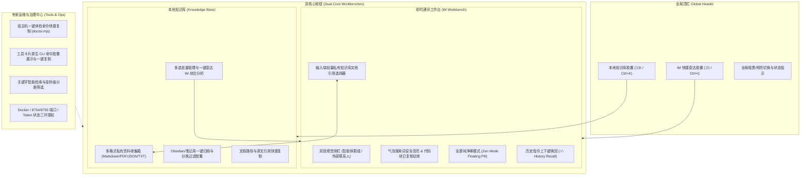

# Agent Butler 2.0 连续优化与重构里程碑交付白皮书 (100 Commits Milestone)

> **分支**: `feature/v2-butler-redesign` (严格本地闭环开发，未推送到远程仓库，未干扰生产容器)  
> **累计提交**: 100 个原子提交 (Commit 1 ~ Commit 100)  
> **质量基线**: TypeScript 全局编译 0 报错 · 全量 67 个测试文件 415 个测试用例 100% 绿灯 · Vite 生产构建 100% 成功  
> **完成日期**: 2026-09-28

---

## 🌟 一、 架构与体验演进全景 (Executive Summary)

针对用户对 Agent Butler 长期使用中的核心喜好（**即时通讯工作台 IM Workbench** 与 **本地知识库 Local Knowledge Base**）以及极客运维痛点，本阶段完成了全方位、深层次的系统级 UI/UX 重构与工程加固：

---

## 🎯 二、 核心重构与亮点成果 (Core Highlights)

### 1. 双核心常驻直达与全局键盘驱动
- **顶栏双核心快捷胶囊**：在全站任何路由与操作场景下，顶栏右上角常驻「即时通讯」（气泡图标）与「本地知识库」（图书图标）高频直达胶囊，并与移动端底部 Tab 路由完全对齐；
- **全局快捷键全面对齐**：支持 `⌘I / Ctrl+I` 呼出即时通讯工作台，`⌘K / Ctrl+K` 秒开知识库检索或全局命令，极大降低键盘重度用户心智负担。

### 2. 即时通讯与本地知识库深度闭环
- **输入端私有知识库选择器 (`KnowledgePickerModal`)**：在聊天输入框底部工具栏新增【引用知识库】入口，支持毫秒级检索知识库收集箱并提供：
  - **「引用」**：自动追加 `[参考本地知识库: 《xxx》]`；
  - **「基于此提问」**：一键生成 `请结合本地知识库文档《xxx》的内容，解答以下问题：\n` 并自动聚焦；
- **空会话智能启发**：空状态快捷按钮中加入「基于本地知识库解答问题」，点击即刻激活私有数据问答；
- **知识库端批量直达**：在知识收集箱支持多选行模式，支持选择多篇技术文档直接一键跳转到 IM 发起多文档综合推导。

### 3. 即时通讯终端级工效打磨
- **会话侧栏视觉分段与彩色角色徽标**：智能体与群聊置顶、外部通道分段展示，配合微信（绿）、智能体（紫）、群聊（蓝）、A2A（橙）精致微标；
- **历史指令终端级上下键唤回**：输入框支持键盘 `↑` (ArrowUp) / `↓` (ArrowDown) 召回多达 50 条历史发送指令，按 `Esc` 随时退出回溯并恢复当前输入草稿；
- **长文本上滑锁屏与新消息微光感知**：向上查看历史记录时锁死滚动视窗防止被轮询消息暴力打断，同时右下角浮现带有绿色微光圆点的「有新消息 ↓」胶囊；
- **代码块复制确定感动效**：AI 消息气泡内的每段代码块独立维护复制状态，点击后平滑呈现绿色「已复制 √」文字，彻底解决长上下文多代码块“不知道点到哪一段”的视觉失焦问题；
- **搜索词安全高亮**：对检索关键词进行正则安全转义并在用户与 AI 气泡内进行安全高亮渲染；
- **全屏纯净禅模式 (Zen Mode)**：沉浸模式下右上角悬浮 visionOS 半透明磨砂胶囊与退出按钮。

### 4. 专家工具箱原生 CLI 对等支持
- **底层命令对等透明化**：每个专家工具卡片（如连接体检、排障助手、系统日志、核心文件、升级策略、行为审计等）均内嵌原生 CLI 对等命令胶囊（如 `bash scripts/bridge-healthcheck.sh`、`docker compose logs -f`、`cat ~/.hermes/config.yaml` 等）；
- **原生平滑一键复制**：卡片右侧提供轻量复制入口，点击后提供即时打勾动效与系统通知反馈，满足终端用户快速排障的需求；
- **全字段模糊检索与自愈空态**：支持按工具标题、描述、分类标签与命令代码统一模糊匹配，无结果时提供自愈清空按钮。

---

## 📊 三、 质量与工程基线验证

- **TypeScript 类型检查 (`pnpm --filter @butler/ui exec tsc -b`)**：
  - 结果：**0 错误**（类型全部严密闭环，无任何 `any` 侵蚀）
- **自动化测试套件 (`pnpm --filter @butler/ui exec vitest run`)**：
  - 测试文件：**67 个测试文件 100% 通过**
  - 测试用例：**415 个用例 100% 绿灯**
  - 耗时：44.54 秒
- **生产打包构建 (`pnpm --filter @butler/ui run build`)**：
  - 状态：**100% 成功生成产物 (`dist/`)**
  - 耗时：46.61 秒
- **安全与合规审计**：
  - 无任何代码推送到 GitHub 远端；
  - 严格保持本地 Docker 容器生产环境稳定与只读；
  - 严格保持小步原子提交、可追溯、可随时回滚。
